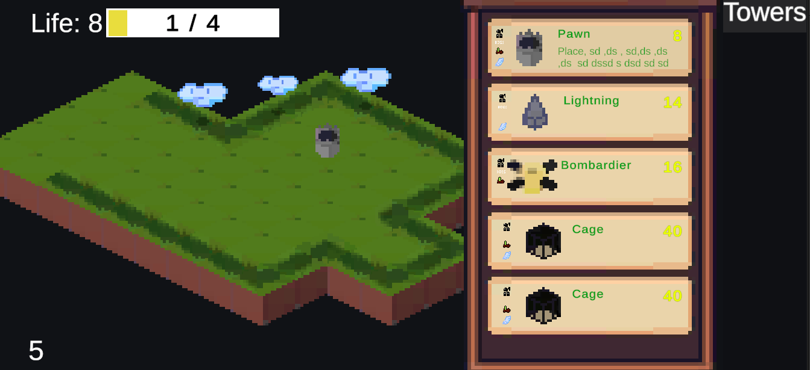
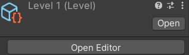
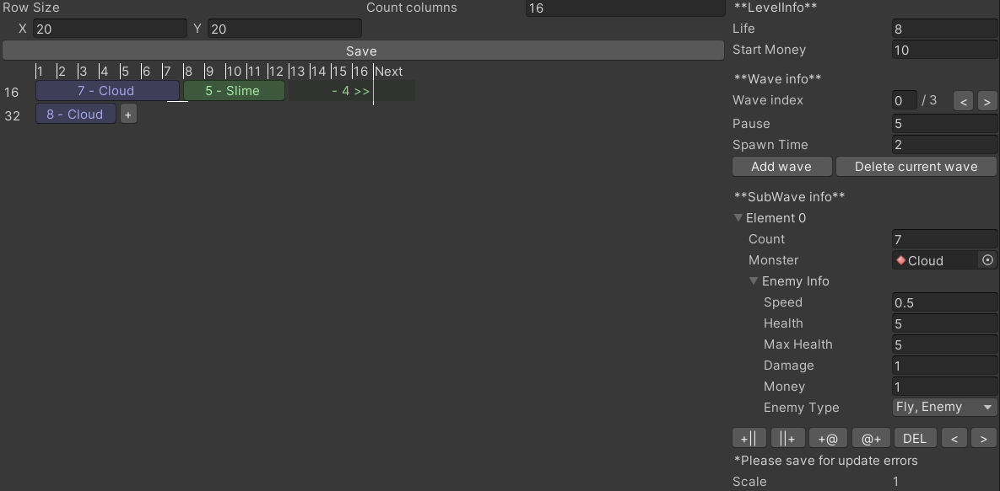

# Swamp tower (UA)

## Зміст

- [Інформація про гру](#інформація-про-гру)

## Інформація про гру

### Опис

Swamp Towers - гра в жанрі Tower Defense, в якій вам доведеться знищувати монстрів за допомогою башень. Не дайте їм дійти до вашого селища!

### Передісторія

Набридливі монстри знову тероризують селище Swamp, постійно викрадаючи людей. Жителі змирилися з цим, але один інженер вирішив поставити край стражданням. Для цього він застосував кристал душ, який оживляв неживі будівлі. Спочатку це були живі фортеці, які при ушкодженні генерувалися, а потім хтось випадково викинув стріли, і тепер ця башня стала стрілецькою. Змінивши конструкцію, інженер отримав серію бойових башень. Але монстри теж не дурні і почали створювати собі подібних за допомогою кристала душ та нападати ордою. Щоб поставити край стражданням, розвідка знайшла джерело генерації монстрів та траєкторію руху. Виявилося, що кристал душ слабшає при знищенні кожного монстра, тому вирішили оборонятися від монстрів, ставлячи біля траєкторій башні.

### Особливості
Гра містить такі особливості:
- 1 рівень;
- 4 типи башнів: пішак, бомбардир, блискавка та клітка;
- наземні та повітряні монстри, а також 1 бос;
- купівля/продаж башнів за монети.

## Розробка

### Рушій гри
Для розробки гри застосовувався рушій Unity, IDE - Rider, а пізніше - Sublime Text

### Менеджери
Для підтримки роботи гри створені такі менеджери:

|Назва класу|Призначення|
|-|-|
|BuildManager|Для додавання, купування, інформування, оновлення, видалення та продавання башнів|
|LevelBarManager|Для відображення прогресу рівня|
|LifeManager|Для відображення (UI) та зберігання кількості життів|
|ShopManager|Для отримання башні, яку хоче побудувати користувач|
|Spawner|Генерує монстрів на основі Level|

### Scriptable Objects:
|Назва|Призначення|
|-|-|
|Level|Містить інформацію про початкові дані рівня (к-ть монет та життів), інформація про підрівні (хвилі) та під хвилі|
|TowerInfoCollection|Містить опис башнів, інформація про їх рівні, ціна купівні/продажу башні та час будування|

#### Редактор для Level
Для Level створений редактор - **LevelEditorWindow**

Підтримує створення хвиль, підхвиль, а також має інтуїтивний інтерфейс

